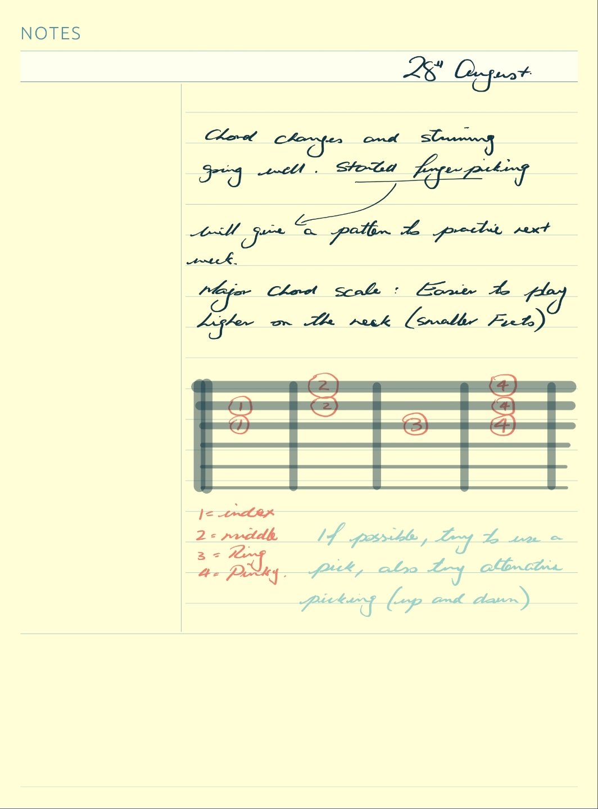
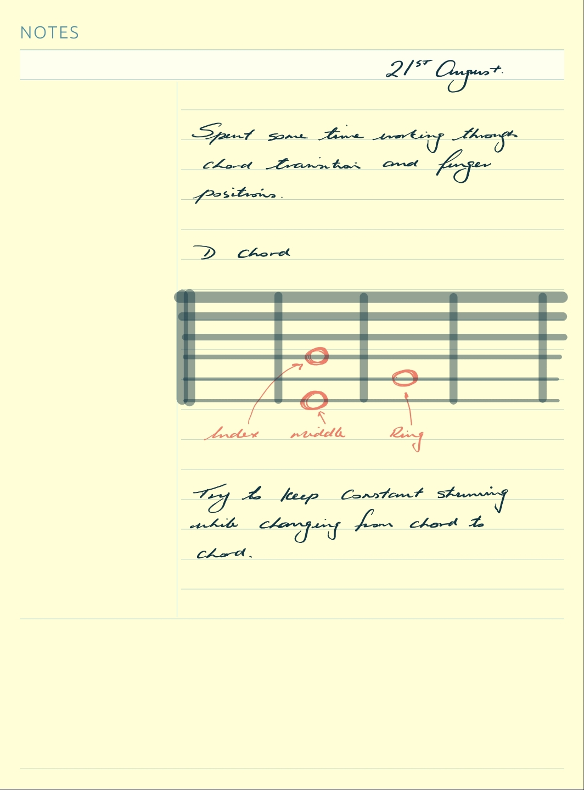
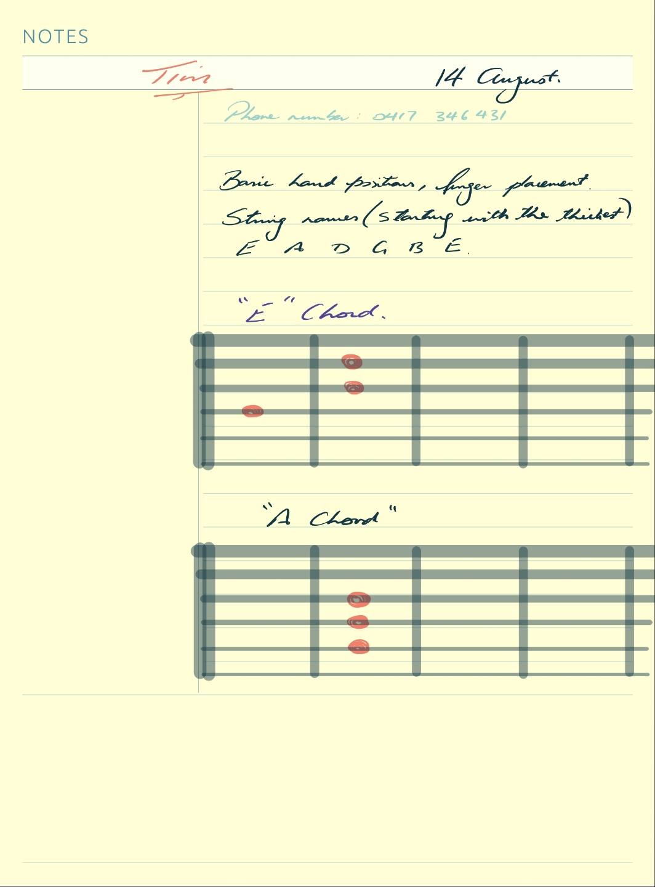

# Guitar Lessons

By Tim Millard

## Week 3

Song Notes: https://songnotes.net/

### 12 Notes

A - A♯ - B - C - C♯ - D - D♯ - E - F - F♯ - G - G♯ 

A - B♭ - B - C - D♭ - D - E♭ - E - F - G♭ - G - A♭ 

♯ - sharp
♭ - flat

## Week 2

## Week 1

Strings: E - A - D - G - B - E

